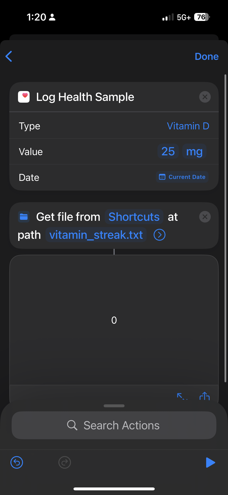
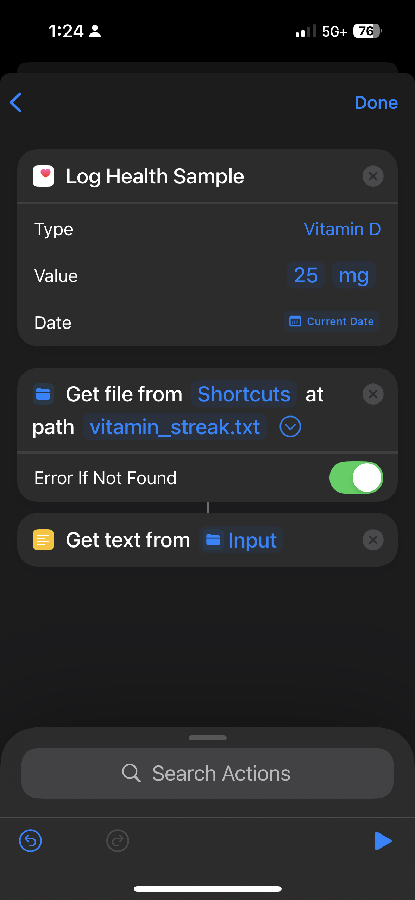
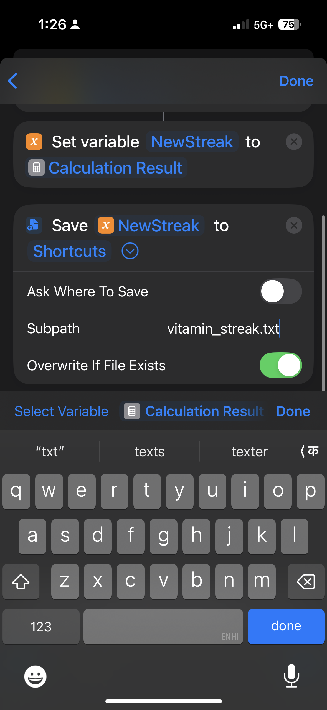
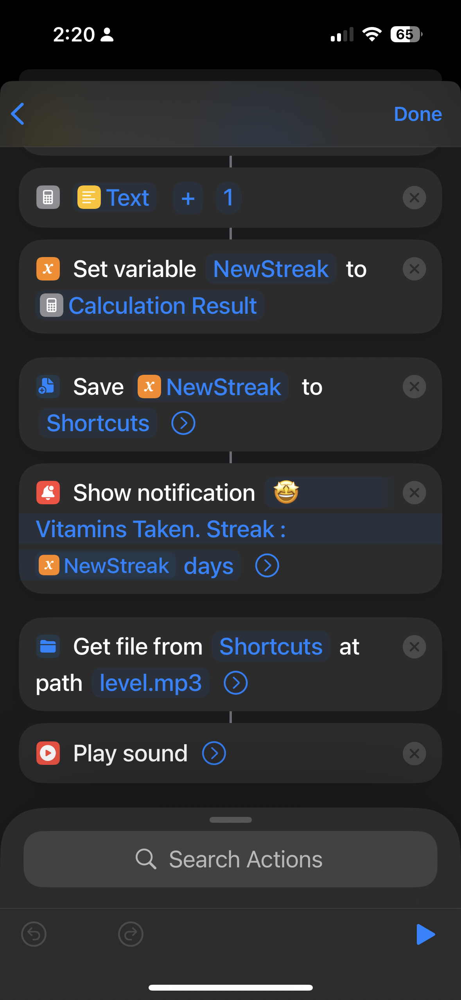

<h1 align="center" style="color:#B3B3E3; font-size:2.5em; font-weight:700;">
  Project-Pavlov
</h1>

  An NFC-enabled cue → routine → reward system

---

<h2 style="color:#B3B3E3;">1. Set up NFC trigger</h2>
<ol>
  <li>Open <b>Shortcuts → Automation → + → Create Personal Automation</b></li>
  <li>Choose <b>NFC</b> → Scan your tag → name it <b>Vitamin</b></li>
  <li>Tap <b>Next</b> to add actions</li>
</ol>

<h2 style="color:#B3B3E3;">2. Add Action: Log to Health app</h2>
<ul>
  <li>Tap <b>Add Action</b> → search <b>Log Health Sample</b></li>
  <li>Choose <b>Log Health Sample</b></li>
  <li>Category: Select your vitamin (or <b>Other</b> if supplements isn’t available)</li>
  <li>Add the quantities</li>
</ul>

<h2 style="color:#FFFFFF;">3. Add Action: Counter System</h2>

<h3 style="color:#FFD6E0;">a. Create a <code>vitamin_streak.txt</code> file</h3>
<ol>
  <li>Open <b>TextEdit</b> (Applications folder)</li>
  <li><code>File → New</code></li>
  <li>Convert to <b>Plain Text</b> (<code>Format → Make Plain Text</code>)</li>
  <li>Save to <b>iCloud Drive</b></li>
  <li>Name it: <code>vitamin_streak.txt</code></li>
</ol>

<h3 style="color:#FFD6E0;">b. Shortcut setup</h3>
<ol>
  <li><b>Get File</b> → choose <code>vitamin_streak.txt</code> (Ask Where to Save → OFF)</li>
  <li><b>Get Text from Input</b> (input = file)</li>
  <li><b>Get Numbers from Input</b> (input = text)</li>
  <li><b>Calculate</b> → <code>Provided Input + 1</code></li>
  <li><b>Set Variable</b> → name it <code>NewStreak</code></li>
  <li><b>Text</b> → use variable <code>NewStreak</code></li>
  <li><b>Save File</b> → overwrite <code>vitamin_streak.txt</code> (Replace → ON)</li>
  <li><b>Show Notification</b>:  
    <pre style=" padding:8px; border-radius:8px;">
Vitamins taken! Streak: [NewStreak] days
    </pre>
  </li>

  <li><b>Play Sound</b> → choose a short positive sound (e.g., Chime or Glass)</li>

 

</ol>

<h2 style="color:#FFFFFF;">Result</h2>

Each time you scan your <b>Vitamin NFC tag</b>, it will:

<ul>
  <li>Log your vitamin intake in the Health app</li>
  <li>Increment and save your streak counter</li>
  <li>Show a notification with your updated streak</li>
  <li>Play a sound as a final reward</li>
</ul>

